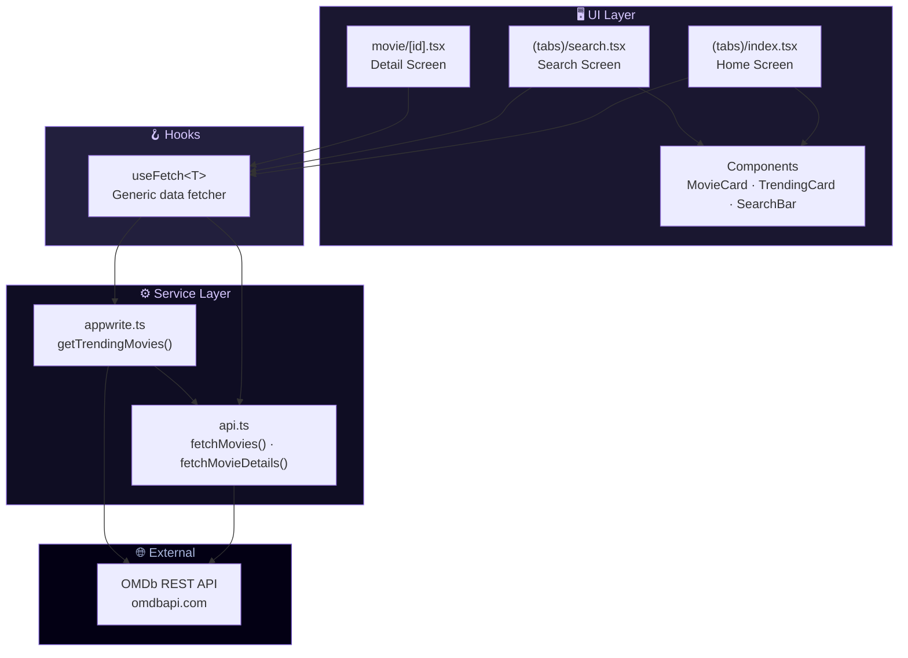
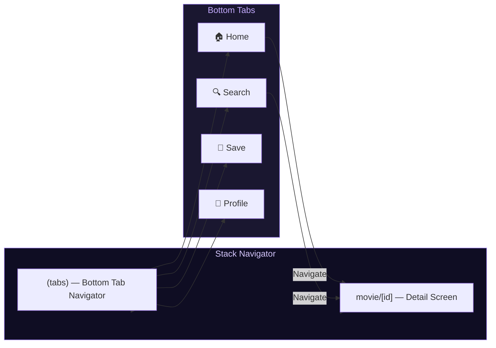

<p align="center">
  
</p>

<h1 align="center">🎬 React Native Movie App</h1>

<p align="center">
  <strong>Discover, search, and explore movies — beautifully crafted for every platform.</strong>
</p>

<p align="center">
  A cross-platform mobile application built with React Native, Expo SDK 52, and TypeScript. Browse trending films, search the OMDb database, and dive into rich movie details — all wrapped in a stunning purple-accented dark UI.
</p>

<p align="center">
  
  
  
  
  
  
</p>

---

## ✨ Features

| | Feature | Description |
|---|---|---|
| 🔥 | **Trending Movies** | Horizontal scrollable cards showcasing top-rated films with gradient rank overlays |
| 🔍 | **Smart Search** | Debounced search powered by the OMDb API with real-time results |
| 🎞️ | **Rich Details** | Full movie metadata — ratings, box office, awards, cast, plot & more |
| 🎨 | **Stunning Dark UI** | Deep blue-black theme with purple accents and glassmorphism effects |
| 📱 | **Cross-Platform** | Runs natively on iOS, Android, and Web from a single codebase |
| ⚡ | **File-Based Routing** | Expo Router v4 with intuitive nested navigation |
| 🧩 | **Modular Architecture** | Clean separation of components, services, types, and constants |
| 💜 | **Custom Design System** | Curated color palette, masked views, gradients, and blur effects |

---

## 📸 Screenshots

<p align="center">
  
  &nbsp;&nbsp;
  
  &nbsp;&nbsp;
  
</p>

<p align="center">
  <em>Home • Search • Movie Details</em>
</p>

---

## 🏗️ Architecture

### High-Level Data Flow



### Navigation Architecture



---

## 🛠️ Tech Stack

| Category | Technology | Version |
|---|---|---|
| **Framework** | React Native | `0.76.9` |
| **SDK** | Expo | `~52.0.49` |
| **Language** | TypeScript | `5.3+` |
| **Routing** | Expo Router | `~4.0.22` |
| **Styling** | NativeWind (TailwindCSS v3) | `^4.1.23` |
| **Animations** | React Native Reanimated | `~3.16.1` |
| **Gradients** | Expo Linear Gradient | `~14.0.2` |
| **Blur Effects** | Expo Blur | `~14.0.3` |
| **Masked Views** | @react-native-masked-view | `0.3.2` |
| **Icons** | React Native Heroicons | `^4.0.0` |
| **API** | OMDb API | — |
| **Package Manager** | npm | — |

---

## 🚀 Getting Started

### Prerequisites

| Requirement | Minimum Version |
|---|---|
| **Node.js** | `18.x` or later |
| **npm** | `9.x` or later |
| **Expo CLI** | Latest (`npx expo`) |
| **iOS** | Xcode 15+ (macOS only) |
| **Android** | Android Studio with SDK 34+ |

### Installation

```bash
# 1. Clone the repository
git clone https://github.com/your-username/MovieApp.git
cd MovieApp

# 2. Install dependencies
npm install

# 3. Set up environment (API key is pre-configured)
#    The OMDb API key is embedded in services/api.ts
```

### Running the App

```bash
# Start the Expo development server
npm start

# Run on specific platforms
npm run android     # 📱 Android emulator/device
npm run ios         # 🍎 iOS simulator (macOS only)
npm run web         # 🌐 Web browser

# Quality checks
npm test            # 🧪 Run Jest test suite
npm run lint        # 🔍 Run ESLint
```

> **💡 Tip:** Press `a` for Android, `i` for iOS, or `w` for Web after starting the dev server.

---

## 📁 Project Structure

```
MovieApp/
│
├── 📂 app/                           # Expo Router — file-based routing
│   ├── _layout.tsx                   # Root Stack navigator & StatusBar config
│   ├── globals.css                   # TailwindCSS @base/@components/@utilities
│   │
│   ├── 📂 (tabs)/                    # Bottom Tab Navigator group
│   │   ├── _layout.tsx               # Tab bar config (Home, Search, Save, Profile)
│   │   ├── index.tsx                 # 🏠 Home — trending carousel + movie grid
│   │   ├── search.tsx                # 🔍 Search — debounced OMDb search
│   │   ├── save.tsx                  # 💾 Saved — bookmarked movies (placeholder)
│   │   └── profile.tsx               # 👤 Profile — user info cards (placeholder)
│   │
│   └── 📂 movie/
│       └── [id].tsx                  # 🎬 Movie Details — dynamic route by IMDb ID
│
├── 📂 components/                    # Reusable UI components
│   ├── MovieCard.tsx                 # Grid card for 3-column movie listings
│   ├── SearchBar.tsx                 # Search input with icon & navigation support
│   └── TrendingCard.tsx              # Horizontal trending card with rank gradient
│
├── 📂 constants/                     # Static asset references
│   ├── icons.ts                      # Icon image imports (8 icons)
│   └── images.ts                     # Background & UI image imports
│
├── 📂 interfaces/                    # TypeScript type declarations
│   └── interfaces.d.ts              # Movie, MovieDetails, TrendingMovie interfaces
│
├── 📂 services/                      # API & data layer
│   ├── api.ts                        # OMDb API calls (search + detail)
│   ├── appwrite.ts                   # Trending movies logic (top 5 hardcoded)
│   └── usefetch.ts                   # Custom useFetch<T> hook
│
├── 📂 types/                         # Additional type declarations
│   └── images.d.ts                   # Image module declarations for TS
│
├── 📂 assets/                        # Static assets
│   ├── 📂 fonts/                     # Custom typefaces
│   ├── 📂 icons/                     # PNG icons (home, search, person, logo, etc.)
│   ├── 📂 images/                    # App images (bg, highlight, logo, gradient)
│   └── 📂 readme/                    # README screenshot assets
│
├── app.json                          # Expo app configuration
├── babel.config.js                   # Babel — NativeWind JSX + Reanimated
├── metro.config.js                   # Metro bundler — NativeWind CSS input
├── tailwind.config.js                # TailwindCSS theme & custom colors
├── tsconfig.json                     # TypeScript config with @ path alias
├── package.json                      # Dependencies & scripts
└── vercel.json                       # Vercel web deployment config
```

---

## 🎨 Design System

### Color Palette

| Swatch | Name | Hex | Usage |
|---|---|---|---|
|  | `primary` | `#030014` | Deep blue-black background |
|  | `secondary` | `#151312` | Dark card text |
|  | `accent` | `#AB8BFF` | Purple accent — buttons, highlights |
|  | `accent-light` | `#C4ABFF` | Light purple |
|  | `accent-dark` | `#7B5FD4` | Dark purple |
|  | `gold` | `#FFD700` | Star ratings |
|  | `light-100` | `#D6C7FF` | Light purple text |
|  | `light-200` | `#A8B5DB` | Muted text |
|  | `light-300` | `#9CA4AB` | Subtle text |
|  | `dark-100` | `#221F3D` | Card borders |
|  | `dark-200` | `#0F0D23` | Card backgrounds |
|  | `dark-300` | `#1A1730` | Elevated surfaces |

### Rating Colors

| Swatch | Rating | Hex |
|---|---|---|
|  | Good (7+) | `#4CAF50` |
|  | Average (5–7) | `#FFC107` |
|  | Poor (<5) | `#F44336` |

### Design Principles

- **Dark-first** — Deep blue-black backgrounds reduce eye strain and make content pop
- **Purple accent system** — Three-tier purple palette (light, main, dark) for visual hierarchy
- **Glassmorphism** — Blur effects and translucent surfaces for depth
- **Gradient overlays** — Masked gradient rank numbers on trending cards
- **3-column grid** — Consistent movie poster grid with balanced spacing

---

## 🔌 API Documentation

### OMDb API Integration

| Endpoint | Function | Parameters | Returns |
|---|---|---|---|
| Search | `fetchMovies({query})` | `query: string` — search term or empty for default | `Movie[]` |
| Details | `fetchMovieDetails(id)` | `id: string` — IMDb ID (e.g., `tt0111161`) | `MovieDetails` |

**Base URL:** `https://www.omdbapi.com/`

**API Key:** `c8c3b4f7` (pre-configured in `services/api.ts`)

### Example Response — Search

```json
{
  "Search": [
    {
      "Title": "The Shawshank Redemption",
      "Year": "1994",
      "imdbID": "tt0111161",
      "Type": "movie",
      "Poster": "https://..."
    }
  ],
  "totalResults": "1",
  "Response": "True"
}
```

### Example Response — Details

```json
{
  "Title": "The Shawshank Redemption",
  "Year": "1994",
  "Rated": "R",
  "Runtime": "142 min",
  "Genre": "Drama",
  "Director": "Frank Darabont",
  "Actors": "Tim Robbins, Morgan Freeman, Bob Gunton",
  "Plot": "Over the course of several years, two convicts...",
  "Ratings": [
    { "Source": "Internet Movie Database", "Value": "9.3/10" },
    { "Source": "Rotten Tomatoes", "Value": "91%" },
    { "Source": "Metacritic", "Value": "82/100" }
  ],
  "BoxOffice": "$28,767,189",
  "Awards": "Nominated for 7 Oscars. 21 wins & 43 nominations total"
}
```

### Trending Movies

The trending system uses a hardcoded list of top-rated IMDb IDs:

| Rank | Movie | IMDb ID |
|---|---|---|
| 1 | The Shawshank Redemption | `tt0111161` |
| 2 | The Godfather | `tt0068646` |
| 3 | The Dark Knight | `tt0468569` |
| 4 | Schindler's List | `tt0108052` |
| 5 | The Lord of the Rings: The Return of the King | `tt0167260` |

---

## 🧩 Component API Reference

### `<MovieCard />`

Renders a movie poster card in the grid layout.

| Prop | Type | Required | Description |
|---|---|---|---|
| `imdbID` | `string` | ✅ | IMDb identifier for navigation |
| `Title` | `string` | ✅ | Movie title |
| `Year` | `string` | ✅ | Release year |
| `Type` | `string` | ✅ | Content type (movie, series, episode) |
| `Poster` | `string` | ✅ | Poster image URL |

```tsx
<MovieCard
  imdbID="tt0111161"
  Title="The Shawshank Redemption"
  Year="1994"
  Type="movie"
  Poster="https://..."
/>
```

---

### `<SearchBar />`

Reusable search input with icon and dual-mode behavior.

| Prop | Type | Required | Description |
|---|---|---|---|
| `placeholder` | `string` | ❌ | Input placeholder text |
| `onPress` | `() => void` | ❌ | Tap handler (home screen — navigates to search) |
| `onChangeText` | `(text: string) => void` | ❌ | Text change handler (search screen — filters results) |
| `value` | `string` | ❌ | Current input value |

```tsx
// On Home screen — navigates to search
<SearchBar placeholder="Search movies..." onPress={() => router.push('/search')} />

// On Search screen — live filtering
<SearchBar placeholder="Search..." value={query} onChangeText={setQuery} />
```

---

### `<TrendingCard />`

Horizontal scrollable card with a gradient-masked rank number overlay.

| Prop | Type | Required | Description |
|---|---|---|---|
| `movie` | `TrendingMovie` | ✅ | Trending movie data object |
| `index` | `number` | ✅ | Position index (used for rank display) |

```tsx
<TrendingCard
  movie={{ movie_id: "tt0111161", title: "...", poster_url: "...", count: 100, searchTerm: "..." }}
  index={0}
/>
```

---

### `useFetch<T>` Hook

Generic data fetching hook with loading, error, and refetch capabilities.

```tsx
const { data, loading, error, refetch, reset } = useFetch<Movie[]>(
  () => fetchMovies({ query: "Batman" }),
  true // autoFetch on mount
);
```

| Return | Type | Description |
|---|---|---|
| `data` | `T \| null` | Fetched data |
| `loading` | `boolean` | Loading state |
| `error` | `Error \| null` | Error object if request failed |
| `refetch` | `() => void` | Manually re-trigger the fetch |
| `reset` | `() => void` | Reset data, loading, and error states |

---

## 🧪 TypeScript Interfaces

```typescript
interface Movie {
  imdbID: string;
  Title: string;
  Year: string;
  Type: string;
  Poster: string;
}

interface MovieDetails {
  Title: string;
  Year: string;
  Rated: string;
  Runtime: string;
  Genre: string;
  Director: string;
  Actors: string;
  Plot: string;
  Poster: string;
  Ratings: { Source: string; Value: string }[];
  BoxOffice: string;
  Awards: string;
  // ... additional OMDb fields
}

interface TrendingMovie {
  movie_id: string;
  title: string;
  poster_url: string;
  count: number;
  searchTerm: string;
}

interface TrendingCardProps {
  movie: TrendingMovie;
  index: number;
}
```

---

## 🤝 Contributing

Contributions are welcome! Here's how you can help:

1. **Fork** the repository
2. **Create** a feature branch
   ```bash
   git checkout -b feature/amazing-feature
   ```
3. **Commit** your changes
   ```bash
   git commit -m "feat: add amazing feature"
   ```
4. **Push** to the branch
   ```bash
   git push origin feature/amazing-feature
   ```
5. **Open** a Pull Request

### Commit Convention

| Prefix | Purpose |
|---|---|
| `feat:` | New feature |
| `fix:` | Bug fix |
| `docs:` | Documentation only |
| `style:` | Formatting, no logic change |
| `refactor:` | Code restructuring |
| `test:` | Adding or updating tests |
| `chore:` | Build process, dependencies |

### Development Guidelines

- Write all new code in **TypeScript**
- Use **NativeWind** classes for styling (avoid inline `style` objects)
- Follow the existing **file-based routing** conventions
- Add types to `interfaces/interfaces.d.ts` for new data shapes
- Test on both **iOS and Android** before submitting PRs

---

## 📄 License

This project is licensed under the **MIT License**.

```
MIT License

Copyright (c) 2025 React Native Movie App

Permission is hereby granted, free of charge, to any person obtaining a copy
of this software and associated documentation files (the "Software"), to deal
in the Software without restriction, including without limitation the rights
to use, copy, modify, merge, publish, distribute, sublicense, and/or sell
copies of the Software, and to permit persons to whom the Software is
furnished to do so, subject to the following conditions:

The above copyright notice and this permission notice shall be included in all
copies or substantial portions of the Software.

THE SOFTWARE IS PROVIDED "AS IS", WITHOUT WARRANTY OF ANY KIND, EXPRESS OR
IMPLIED, INCLUDING BUT NOT LIMITED TO THE WARRANTIES OF MERCHANTABILITY,
FITNESS FOR A PARTICULAR PURPOSE AND NONINFRINGEMENT. IN NO EVENT SHALL THE
AUTHORS OR COPYRIGHT HOLDERS BE LIABLE FOR ANY CLAIM, DAMAGES OR OTHER
LIABILITY, WHETHER IN AN ACTION OF CONTRACT, TORT OR OTHERWISE, ARISING FROM,
OUT OF OR IN CONNECTION WITH THE SOFTWARE OR THE USE OR OTHER DEALINGS IN THE
SOFTWARE.
```

---

<p align="center">
  Built with 💜 using React Native & Expo
</p>

<p align="center">
  <a href="#-react-native-movie-app">Back to Top ↑</a>
</p>
